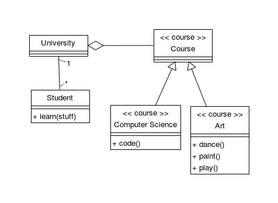

# Omelette 

Omelette is a language dedicated to describe UML diagrams.
Currently we only support class and use case diagrams, but the language and compiler are designed to be extensible.

The project consists of three parts:

- Omelette – the language used to describe UML diagrams
- Fromage – a simple IDE for editing, generating and exporting diagrams
- cli – a command-line compiler

## Dependencies

Omelette requires **pyQT** and **pyparsing**.

Although it's not required, we encourage you to install **pygraphviz**.
We offer two built-in layout algorithms, but they aren't very impressive.

## User manual

Currently there's no such thing.

If you speak Polish, you can read [our report](doc/raport/raport.pdf).
You will find a semi-formal description of the language syntax there.

## Code example

```
class Student
    + learn(stuff)

class University

association
    source-object: Student
    target-object: University

prototype class course
    stereotype: "course"

course Course

course compSci
    name: "Computer Science"
    + code()

course Art
    + dance()
    + paint()
    + play()

prototype generalisation is_crs
    target-object: Course

is_crs
    source-object: compSci
is_crs
    source-object: Art
```

This compiles to:



As you can see, the language is pretty powerful.
This example covers some features of Omelette:

- classes and different types of relations (currently we also support notes, use cases and actors)
- properties and methods (we also support attributes)
- prototyping (`Course`, `compSci` and `Art` inherit stereotype from `course`)
- anonymous objects (inheriting target object from `is_crs`)

[more examples](doc/example/)
