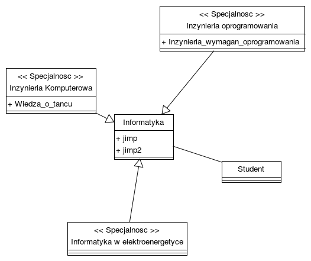
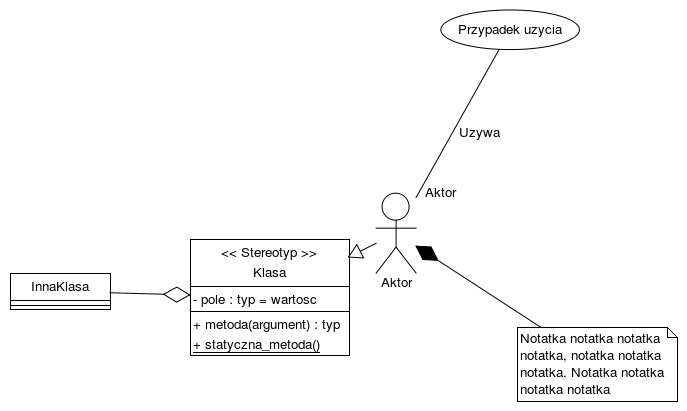
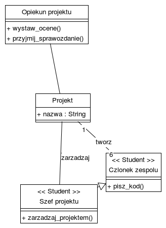

# #1

```
class Student

association
    source-object: Student
    target-object: Informatyka

class Informatyka
    + jimp
    + jimp2

prototype class spec
    stereotype: "Specjalnosc"

spec IO
    name: "Inzynieria oprogramowania"
    + Inzynieria_wymagan_oprogramowania

spec IK
    name: "Inzynieria Komputerowa"
    + Wiedza_o_tancu

spec IWE
    name: "Informatyka w elektroenergetyce"

prototype generalization is_specjalnosc
    target-object: Informatyka

is_specjalnosc
    source-object: IO
is_specjalnosc
    source-object: IK
is_specjalnosc
    source-object: IWE
```



# #2

```
class Klasa
    stereotype: "Stereotyp"
    + metoda(argument) : typ
    - pole : typ = "wartosc"
    _+ statyczna_metoda()

class InnaKlasa

note Notatka
    text: "Notatka notatka notatka notatka, notatka notatka notatka. Notatka notatka notatka notatka"

actor Aktor

usecase uc
    name: "Przypadek uzycia"

association
    source-object: Aktor
    source-count: 1
    source-role: "Aktor"
    target-object: uc
    name: "Uzywa"

generalization
    source-object: Aktor
    target-object: Klasa

composition
    source-object: Aktor
    target-object: Notatka

aggregation
    source-object: Klasa
    target-object: InnaKlasa
```



# #3

```
class Projekt
    + nazwa : String

class o
    name: "Opiekun projektu"
    + wystaw_ocene()
    + przyjmij_sprawozdanie()

class c
    name: "Czlonek zespolu"
    stereotype: "Student"
    + pisz_kod()

class pm
    name: "Szef projektu"
    stereotype: "Student"
    + zarzadzaj_projektem()

association
    source-object: o
    target-object: Projekt

association
    name: "tworz"
    source-object: c
    source-count: 6
    target-object: Projekt
    target-count: 1

generalization
    source-object: pm
    target-object: c

association
    name: "zarzadzaj"
    source-object: pm
    target-object: Projekt
```


